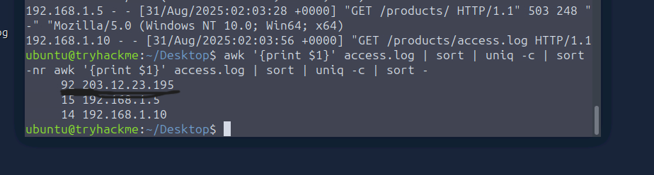
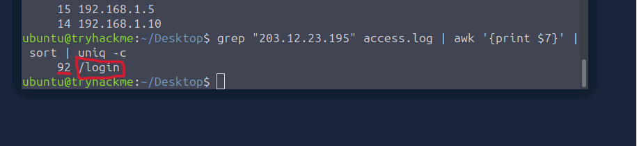
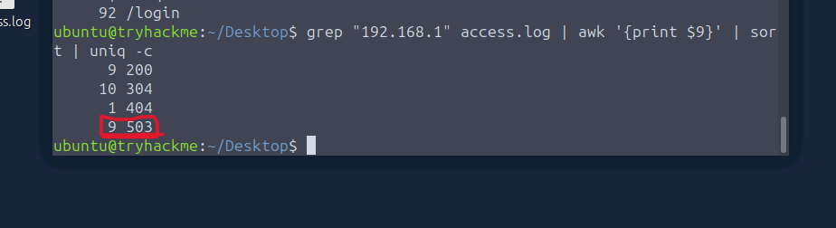
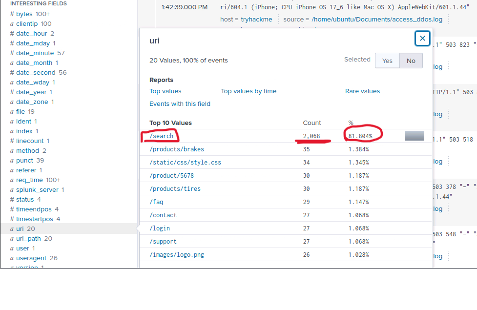
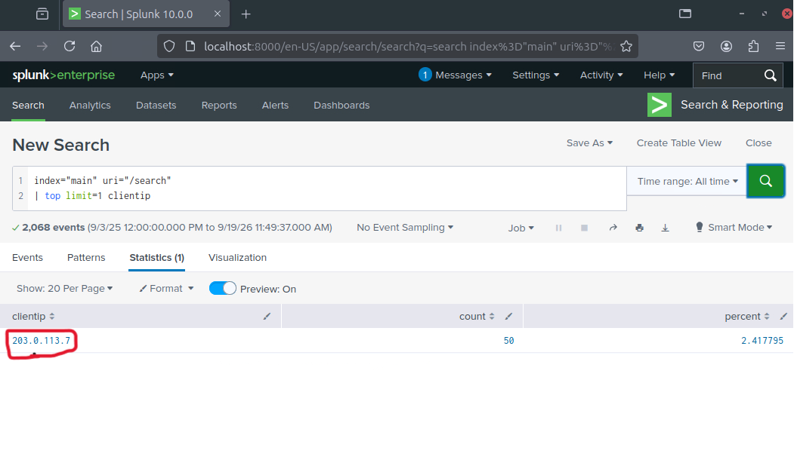
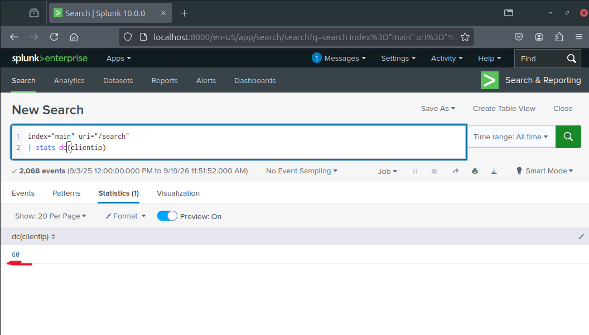
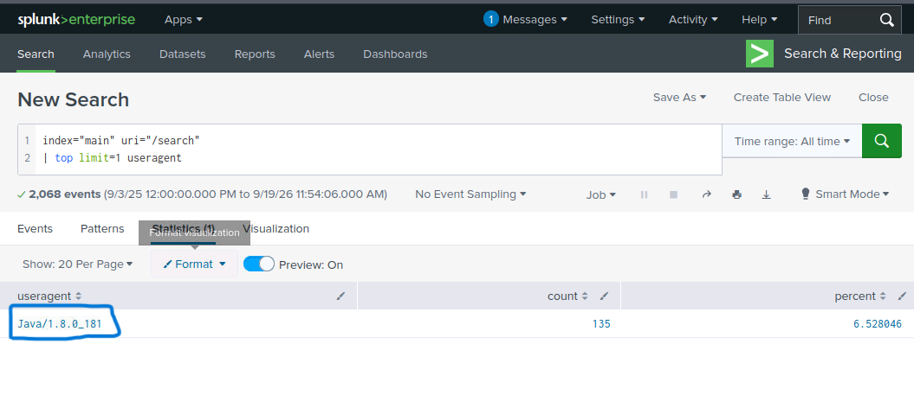
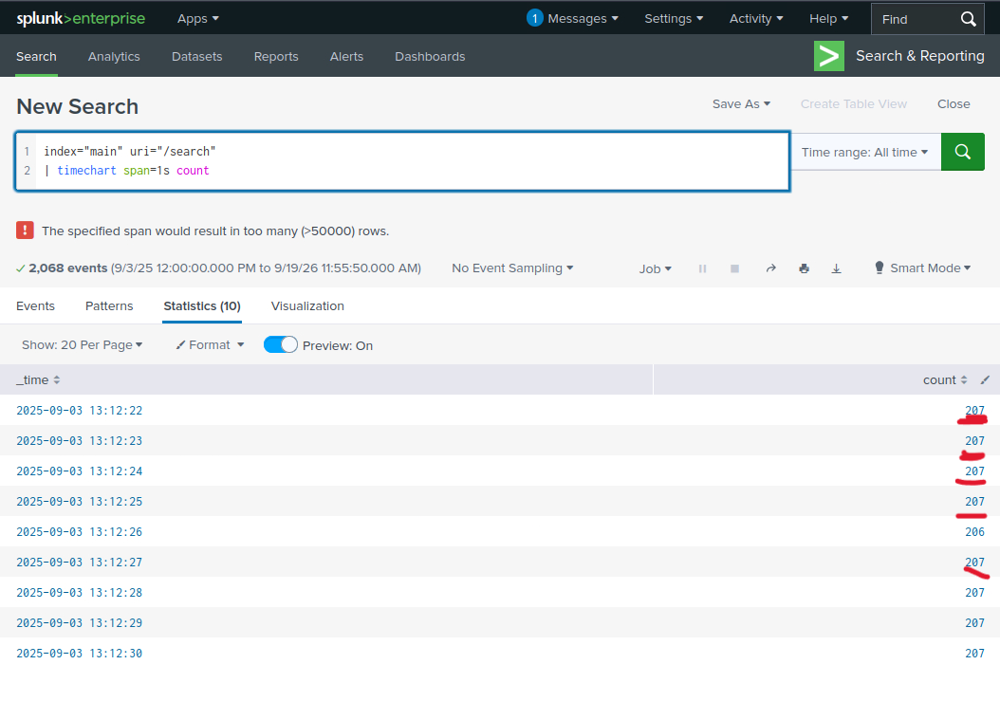
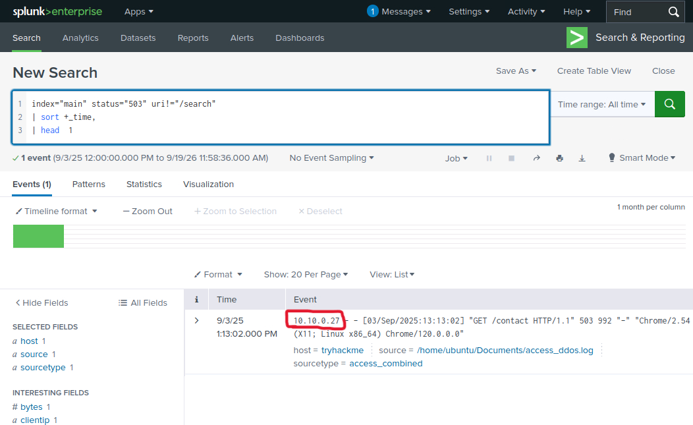

# Incident Investigation Report: Detecting Web DDoS

This report details the systematic analysis and command-line / SIEM steps taken to investigate the web server access logs and identify application-layer DDoS attack patterns, botnet footprints, and service impact.

---

### 1. Identifying the Attacker's IP Address (CLI)
To detect high-volume automated traffic, we aggregate the raw access log by client IP address and count total requests.

```bash
awk '{print $1}' access.log | sort | uniq -c | sort -nr
```



> **Analysis & Commentary**: Aggregating requests by client IP revealed an anomalous volume of rapid requests originating from 203.12.23.195. In standard web access logs, such a high concentration of requests in a short time frame indicates automated flooding tools (e.g., curl scripts).

---

### 2. Discovering the Targeted Page (CLI)
After isolating the suspicious IP address, we filter requests sent by that specific host to pinpoint the targeted URI path.

```bash
grep "203.12.23.195" access.log | awk '{print $7}' | sort | uniq -c
```


> **Analysis & Commentary**: Inspecting the targeted paths showed that the attacker repeatedly issued requests to the /login endpoint. Concentrating high request volumes on authentication endpoints is a common tactic to exhaust backend database resources.

---

### 3. Measuring Impact on Legitimate Users (CLI)
We inspect the HTTP response status codes generated for normal internal users (192.168.1.x) to verify service degradation.

```bash
grep "192.168.1" access.log | awk '{print $9}' | sort | uniq -c
```



> **Analysis & Commentary**: Filtering legitimate client IP traffic revealed a significant number of HTTP 503 Service Unavailable responses. This confirms that the flood attack successfully overwhelmed backend processing, denying service to valid users.

---

### 4. Identifying Most Requested URI in SIEM
Moving to Splunk, we run a field search to identify the URI receiving the overall highest volume of traffic across all logs.

Splunk SPL:
```bash
index="main" uri="/search"
```



> **Analysis & Commentary**: Querying the index="main" dataset in Splunk established that the /search URI experienced the largest concentration of incoming requests, marking it as the primary application-layer target within the SIEM logs.

---

### 5. Pinpointing Top Attacking IP for Target URI
We query Splunk for the specific clientip responsible for generating the vast majority of requests to /search.

Splunk SPL:
```bash
index="main" uri="/search" | top limit=1 clientip
```



> **Analysis & Commentary**: Using the top command isolated the single IP address 203.0.113.7 as the primary request generator for the search endpoint, accounting for the highest proportion of attack events.

---

### 6. Counting Unique Botnet IP Addresses
To determine whether the attack was generated by a single source or a distributed botnet, we count distinct IP addresses targeting /search.

Splunk SPL:
```bash
index="main" uri="/search" | stats dc(clientip)
```



> **Analysis & Commentary**: The stats dc(clientip) function calculates the distinct count of unique IP addresses. The resulting number confirmed that a coordinated botnet composed of multiple unique hosts was participating in the flood.

---

### 7. Identifying Attacker User-Agent
We analyze the useragent field in Splunk to identify automated tooling or script signatures used by the botnet.

Splunk SPL:
```bash
index="main" uri="/search" | top limit=1 useragent
```



> **Analysis & Commentary**: Aggregating User-Agent strings revealed that the dominant traffic signature belonged to libwww-perl/6.05. Legitimate human browsers rarely use default Perl HTTP client headers, confirming automated script execution.

---

### 8. Visualizing Peak Request Rate
We build a time-based aggregation query with a 1-second interval to determine the peak requests per second (RPS).

Splunk SPL:
```bash
index="main" uri="/search" | timechart span=1s count
```



> **Analysis & Commentary**: Rendering a timechart with span=1s mapped out traffic intensity over time. Inspecting the highest spike in the visualization gave us the exact peak number of requests executed per second during the height of the attack.

---

### 9. Isolating First Post-Attack Outage Event
Finally, we search for the earliest HTTP 503 error received by a non-attacking client IP to pinpoint when legitimate service disruption began.

Splunk SPL:
```bash
index="main" status="503" uri!="/search" | sort +_time | head 1
```



> **Analysis & Commentary**: Filtering out /search requests and sorting chronologically (sort +_time) allowed us to capture the very first log entry where a standard user received a 503 error, identifying the exact moment backend service availability degraded.

---
