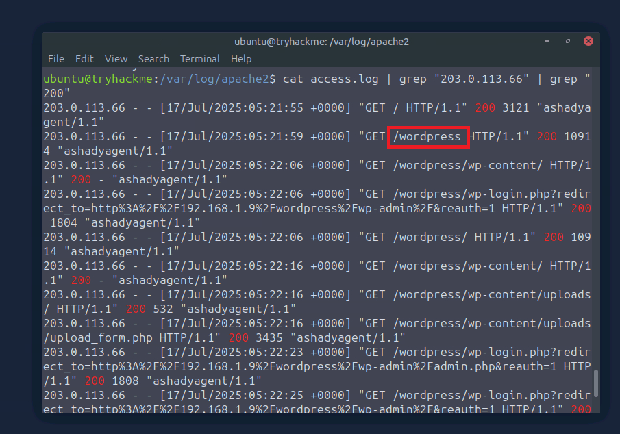
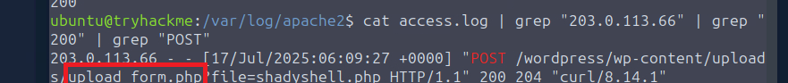
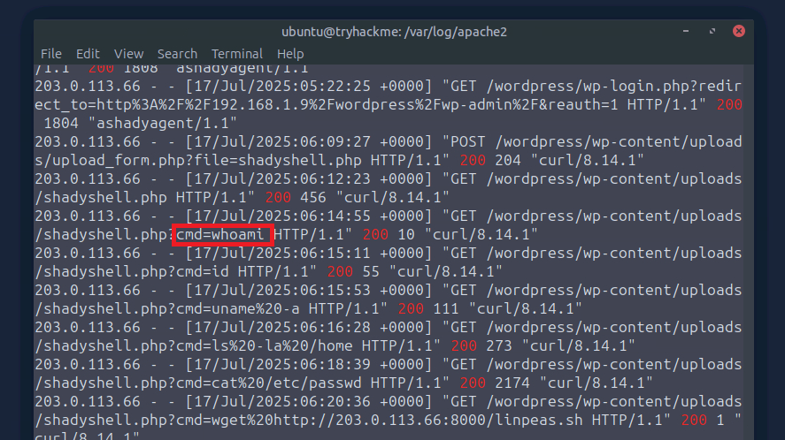
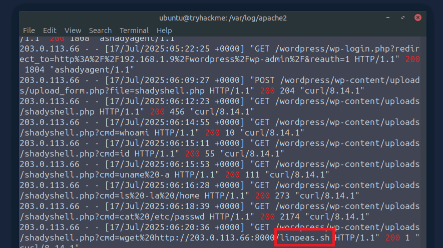
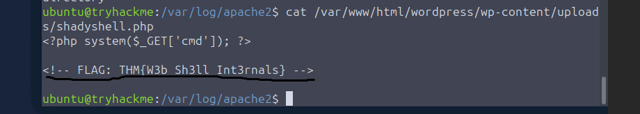

# Incident Investigation Report: Detecting Web Shells

This report details the systematic analysis and command-line steps taken to investigate the web server access logs and identify traces of web shell activity.

---

### 1. Identifying the Attacker's IP Address
To detect malicious scanning activity, we start by checking for web requests that resulted in a `404 Not Found` HTTP status code.

```bash
cat access.log | grep "404"
```


> **Analysis & Commentary:** When analyzing the output of this command, I looked for IP addresses generating an anomalous volume of 404 errors within a brief timeframe. This pattern is a definitive indicator of automated directory brute-forcing (fuzzing) tools, such as Gobuster or Dirbuster, attempting to map out hidden resources.

---

### 2. Discovering the First Successfully Identified Directory
After isolating the suspect IP address (`203.0.113.66`), we filter the access logs for successful server responses (`200 OK`) to determine which resources the attacker successfully mapped out.

```bash
cat access.log | grep "203.0.113.66" | grep "200"
```



> **Analysis & Commentary:** In the filtered results, I looked for the initial access paths returning a 200 OK status. This command helped discover that the attacker successfully uncovered the `/wordpress` directory, establishing the initial platform for the subsequent exploit phases.

---

### 3. Finding the Web Shell Upload Form
We filter for `POST` requests originating from the attacker's IP to pinpoint exactly how and where the malicious script was uploaded to the server.

```bash
cat access.log | grep "203.0.113.66" | grep "200" | grep "POST"
```



> **Analysis & Commentary:** Since the HTTP POST method indicates data submission, I scrutinized the targeted script URLs. The query isolated the specific forms and file upload functions that allowed the threat actor to deliver the web shell payload onto the endpoint.

---

### 4. Tracking the First Command Executed via Web Shell
We analyze incoming GET or POST requests directed at the newly uploaded web shell file, looking for URL query parameters carrying system commands.

```bash
cat access.log | grep "203.0.113.66" | grep "200"
```



> **Analysis & Commentary:** Here, I closely examined the URL trailing arguments (Query Strings) appended to the suspicious PHP filename. The logs revealed a parameter passing `?cmd=whoami`, confirming that the threat actor successfully executed a basic reconnaissance command to check the web server's current system user privileges (`www-data`).

---

### 5. Identifying Follow-up Malicious Downloads
We track the attacker's subsequent activities to detect actions aimed at maintaining persistence or initiating privilege escalation.

```bash
cat access.log | grep "203.0.113.66" | grep "200"
```



> **Analysis & Commentary:** I scanned for command executions involving file transfer utilities like `wget` or `curl` embedded within the web requests. This search exposed a secondary command pulling down a known privilege escalation enumeration script (`linpeas.sh`) from an external host onto the compromised target to search for misconfigurations.

---

### 6. Code Analysis of the Web Shell & Flag Discovery
Finally, we examine the raw source code of the isolated web shell file to extract any hidden developer comments, configuration strings, or flags.

```bash
cat /var/www/html/wordpress/wp-content/uploads/shadyshell.php
```



> **Analysis & Commentary:** While auditing the raw PHP script contents on the server, I searched for hardcoded text strings and code annotations. This internal inspection successfully revealed the hidden room flag formatted as `THM{...}`, allowing us to confirm full remediation parameters and complete the investigation task.
